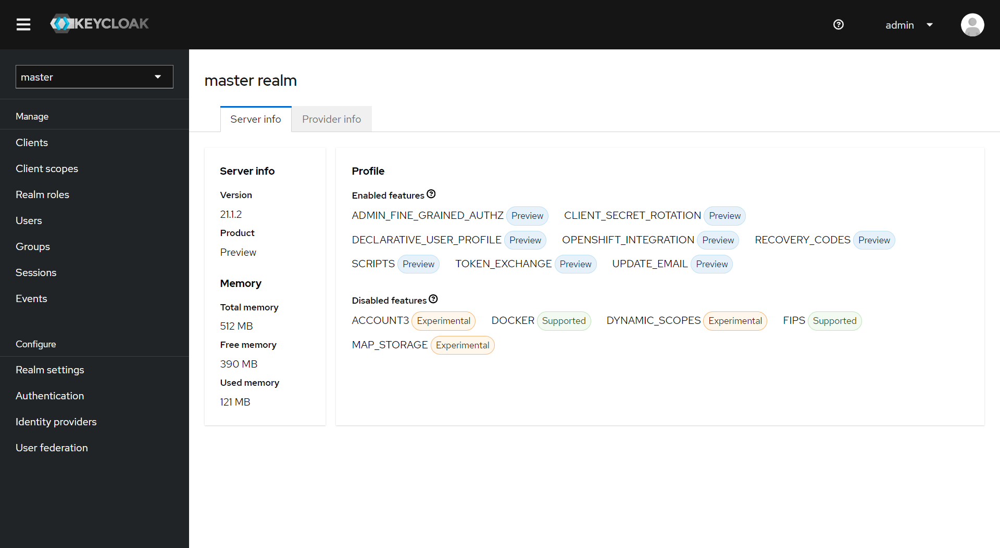
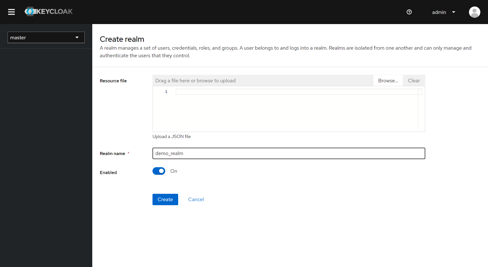
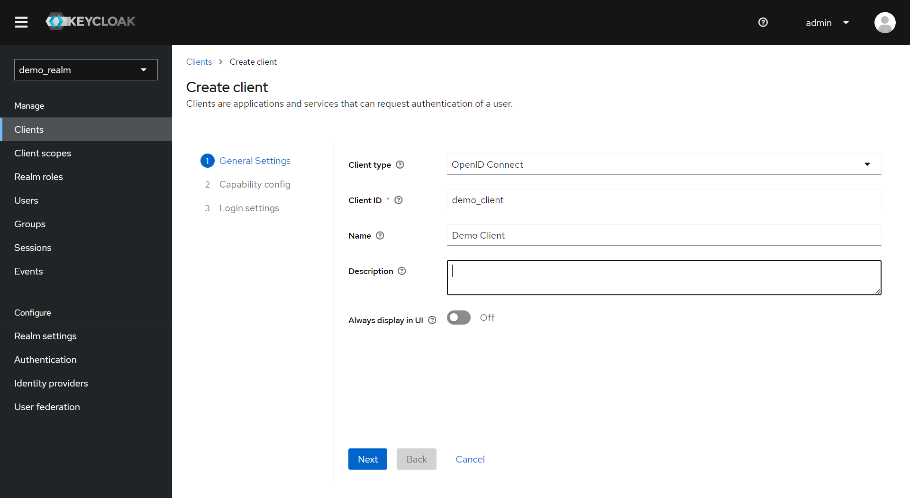
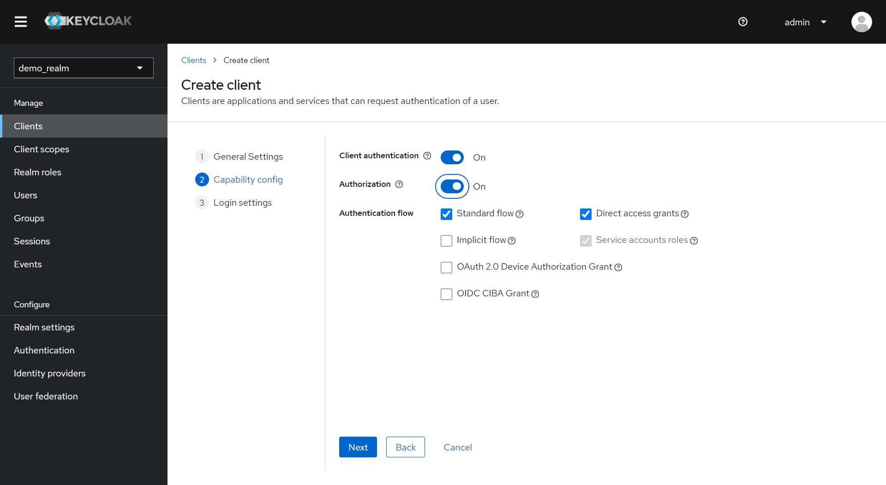
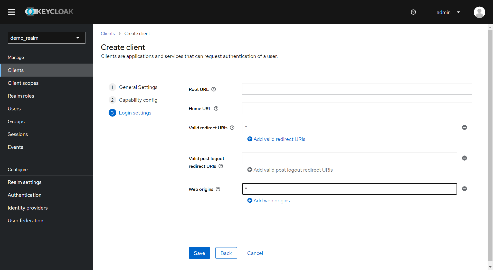
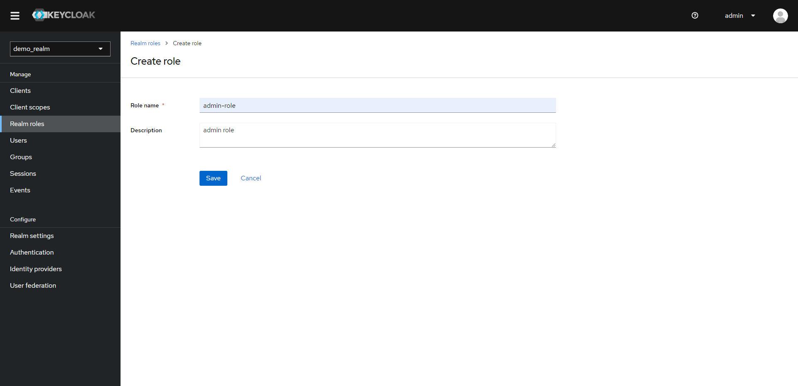
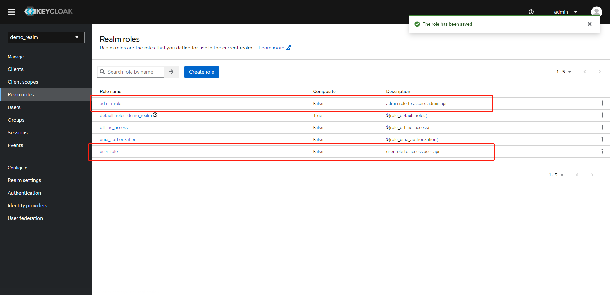
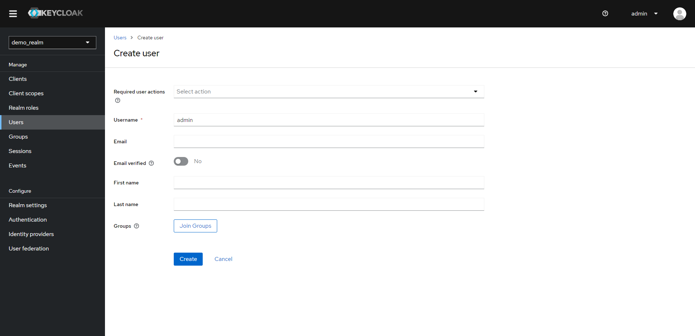
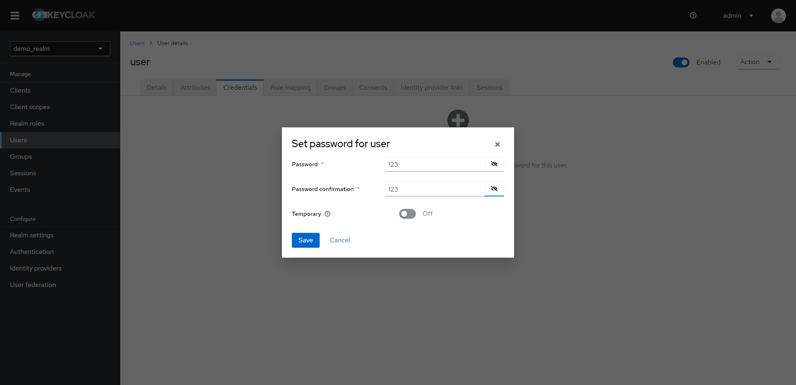
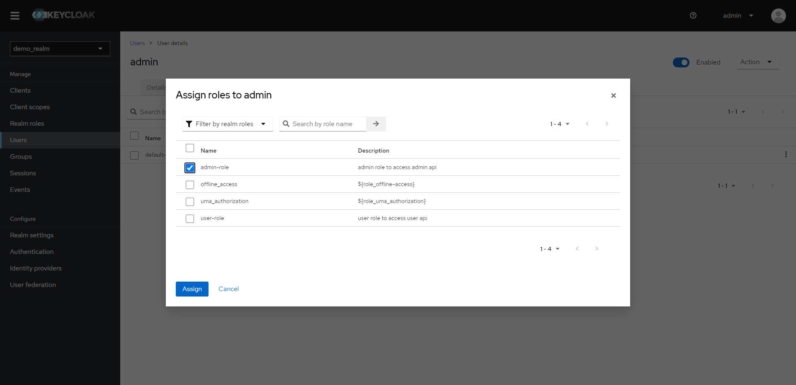

## 用keycloak保护一个springboot接口程序
### docker安装keycloak
```
docker run -p 8080:8080 -e KEYCLOAK_ADMIN=admin -e KEYCLOAK_ADMIN_PASSWORD=admin quay.io/keycloak/keycloak:21.1.2 start-dev
```
以上命令会使用keycloak21.1.2版本启动,访问端口8080,keycloak管理员账户密码admin/admin,打开localhost:8080登录后看到keycloak master管理界面

可以看到有很多菜单,我们需要理解一些keycloak的概念:

- Realm（领域）： 在 Keycloak 中，一个 Realm 相当于一个单一的安全域，包含了一组用户、客户端应用、身份提供者等。每个 Realm 都是相对独立的，具有自己的用户和配置。

- Client（客户端）： 客户端是使用 Keycloak 进行身份验证和授权的应用程序或服务。每个客户端都有一个唯一的标识符，并且必须在特定的 Realm 中注册。

- Client Scope 是一种定义客户端（Client）所需权限和配置的机制。Client Scope 包含了一组在授权过程中可能需要的额外信息，这可以包括访问某些资源所需的额外权限、认证流程等。

- Role（角色）： 角色是授权的一种方式，用于将权限分配给用户或客户端。Keycloak 支持基于角色的访问控制，可以在 Realm 和客户端级别定义角色。

- Realm roles（领域角色）是与整个领域（Realm）相关联的角色。这些角色是在特定领域中定义的，可以被分配给领域内的用户或客户端应用程序。Realm roles 可以用于在领域级别定义通用的权限和访问控制。

- User（用户）： 用户是系统中的最终终端用户，可以通过用户名和密码或其他身份验证方法登录到 Keycloak。用户可以属于一个或多个 Realm，并具有相应的角色和权限。

- Group（群组）是一种用于组织和管理用户的机制。群组允许您将用户组织成逻辑集合，以便更有效地进行权限管理和访问控制。

- Sessions"（会话）是指用户与系统进行交互的一段时间。用户在登录系统后，Keycloak 会为其创建一个会话，以跟踪用户的活动和状态。会话是一种用于管理用户认证状态和授权信息的机制。

- "Events"（事件）是系统中发生的重要活动的记录。这些事件提供了对系统中发生的各种操作和变更的详细信息。通过审计和记录这些事件，系统管理员可以追踪用户活动、监控系统的安全性，以及进行故障排除和调试。
-  "Realm settings"（领域设置）是 Keycloak 中用于配置和管理整个领域（Realm）的一组选项和属性。领域是 Keycloak 
   中的一个独立区域，包含了用户、客户端、角色、身份提供者等组件，而领域设置用于定义和控制领域的全局行为。
   以下是一些可能包含在领域设置中的配置选项：

    - General Settings（常规设置）： 包括领域的名称、显示名称、领域管理员等基本信息。

   - Login Settings（登录设置）： 配置与用户身份验证相关的选项，如密码策略、注销行为、单点登录配置等。

   - Themes（主题）： 配置领域的外观和感觉，包括登录页面的自定义主题、颜色方案等。

   - Security Defenses（安全防御）： 配置安全相关的设置，如防火墙设置、安全头部配置等，以增强系统的安全性。

   - Sessions（会话）： 配置有关用户会话的参数，包括会话的过期时间、IDle超时等。

   - Events（事件）： 配置事件日志和审计日志的设置，以监控和审计系统中发生的各种事件。

   - User Federation（用户联合）： 配置与用户联合相关的设置，例如 LDAP、Active Directory 集成等。

   - Identity Brokering（身份代理）： 配置与身份代理（例如社交登录）相关的设置。

   - Authentication（身份验证）： 配置与身份验证流程和提供者相关的设置。

   - Client Scopes（客户端范围）： 管理客户端范围的配置。

   - User Self-Registration（用户自注册）： 允许或禁止用户自行注册的设置。

   - Internationalization（国际化）： 配置支持多语言的设置。

- Identity Provider（身份提供者）： 身份提供者是用于验证用户身份的外部系统，比如 LDAP、Active Directory、或其他 OpenID Connect 或 SAML 2.0 提供者。Keycloak 
支持与这些身份提供者集成，允许用户通过外部系统进行身份验证。

- "User federations"（用户联合）是指将用户信息集成到 Keycloak 中，以便从外部系统（如LDAP、Active Directory等）检索用户身份信息。Keycloak 提供了用户联合的功能，使您能够在 Keycloak 领域中使用外部系统中的用户信息，而无需在 Keycloak 中手动管理这些用户。

### 添加一个我们保护的client
#### 添加一个demo_realm realm

#### 在demo realm中添加一个demo_client,将demo_client设置为Client authentication(on)和Authorization(on)


"Client Credentials" 和 "Public" 是 OAuth 2.0 授权模型中两种常见的授权类型。它们之间的区别主要体现在授权的流程和用途上。

- Client Credentials（客户端凭证）：

授权模型： 客户端凭证授权是一种面向客户端的授权方式，不涉及用户的身份验证。客户端使用其自身的凭证（客户端ID和客户端秘钥）来请求访问资源。
使用场景： 主要用于客户端自身需要访问受保护资源而不涉及用户的情况，例如客户端需要调用后端 API。这种情况下，客户端以自己的名义进行授权，而不是代表用户。
授权流程： 客户端通过直接向授权服务器发送包含其凭证的请求（通常是 HTTP Basic Authentication 或包含在请求体中的凭证），从而获取访问令牌。
- Public（公开）：

授权模型： 公开授权（也称为授权码授权）是一种面向用户和客户端的授权方式，涉及用户的身份验证。用户向客户端提供其凭证（通常是用户名和密码），客户端使用这些凭证向授权服务器请求访问令牌。
使用场景： 适用于需要用户身份验证的场景，例如用户登录到应用程序，应用程序获取访问令牌以代表用户访问资源。
授权流程： 客户端引导用户前往授权服务器进行身份验证，获得授权码，然后将授权码交换为访问令牌。这样的流程确保了用户的凭证（如密码）不会直接暴露给客户端。

**Authorization**设置为true会开启细粒度权限控制,比如接口权限控制

在 OAuth 2.0 授权流程中，"**Valid Redirect URI**"（有效的重定向 URI）是指授权服务器将用户重定向回的 
URI，用于在用户授权后将令牌传递回客户端应用程序。这是一项安全措施，用于确保授权码或令牌不会被发送到未经授权的重定向 URI。

在 OAuth 2.0 和 OpenID Connect 中，"**Web Origins**"（Web 源）是用于配置客户端允许接受授权码流程回调的域名或 URL 
的设置。这是一项安全措施，用于确保授权码或令牌只能在受信任的网站上使用，防止攻击者将令牌传递给不可信的网站。
### 创建角色
建立角色,基于RBAC权限控制模型,通过不同的角色来控制不同接口的访问权限,角色分为Realm roles和Client roles,Realm roles是整个领域级别的,在该领域的client共享


### 创建用户
创建测试用户admin和user,并分别关联上述角色

设置密码123,关闭临时密码并保存

分配角色

## 搭建springboot api demo
### 依赖spring oauth2
```
<dependencies>
   <dependency>
      <groupId>org.springframework.boot</groupId>
      <artifactId>spring-boot-starter-oauth2-resource-server</artifactId>
   </dependency>
   <dependency>
      <groupId>org.springframework.boot</groupId>
      <artifactId>spring-boot-starter-web</artifactId>
   </dependency>
</dependencies>
```
### Security配置类
```java

@Configuration
@EnableWebSecurity
@EnableMethodSecurity(prePostEnabled = true, securedEnabled = true, jsr250Enabled = true)
public class ResourceServerConfig extends WebSecurityConfigurerAdapter {

   @Override
   protected void configure(HttpSecurity http) throws Exception {
      http.csrf().disable().oauth2ResourceServer()
              .jwt(jwt -> jwt.jwtAuthenticationConverter(jwtAuthenticationConverter()))
              .authenticationEntryPoint(authenticationEntryPoint()).accessDeniedHandler(accessDeniedHandler()).and()
              .exceptionHandling().accessDeniedHandler(accessDeniedHandler());
   }

   @Bean
   public AccessDeniedHandler accessDeniedHandler() {
      return new CustomAccessDeniedHandler();
   }

   @Bean
   public AuthenticationEntryPoint authenticationEntryPoint() {
      return new CustomAuthenticationEntryPoint();
   }

   private Converter<Jwt, ? extends AbstractAuthenticationToken> jwtAuthenticationConverter() {
      JwtAuthenticationConverter jwtConverter = new JwtAuthenticationConverter();
      jwtConverter.setJwtGrantedAuthoritiesConverter(new RealmRoleConverter());
      return jwtConverter;
   }

   private class CustomAuthenticationEntryPoint implements AuthenticationEntryPoint {

      @Autowired
      @Qualifier("handlerExceptionResolver")
      private HandlerExceptionResolver resolver;

      @Override
      public void commence(HttpServletRequest request, HttpServletResponse response, AuthenticationException e)
              throws IOException, ServletException {

         resolver.resolveException(request, response, null, e);
      }
   }

   private class CustomAccessDeniedHandler implements AccessDeniedHandler {

      @Override
      public void handle(HttpServletRequest request, HttpServletResponse response,
                         AccessDeniedException accessDeniedException) throws IOException, ServletException {
         response.setStatus(HttpServletResponse.SC_UNAUTHORIZED);
         response.setContentType(MediaType.APPLICATION_JSON_VALUE);
         response.getWriter().write("Unauthorized Call");
      }
   }
}
```
### keycloak角色转换器
```java
public class RealmRoleConverter implements Converter<Jwt, Collection<GrantedAuthority>> {
   @Override
   public Collection<GrantedAuthority> convert(Jwt jwt) {
      final Map<String, List<String>> realmAccess = (Map<String, List<String>>)jwt.getClaims().get("realm_access");
      return realmAccess.get("roles").stream()
              // prefix required by Spring Security for roles.
              .map(SimpleGrantedAuthority::new).collect(Collectors.toList());
   }
}
```
keycloak的角色信息存储在jwt token claim中的real_access中的roles里面,与标准的oauth2 claim不一样所以需要转换
### bootstrap.yaml配置文件
```yaml
server:
   port: 8080
#keycloak服务器地址
KEYCLOAK-SERVER: ${ENV_KEYCLOAK_SERVER:http://localhost:8081}

spring:
   application:
      name: spring-boot-keycloak-demo
   security:
      oauth2:
         resourceserver:
            jwt:
               #用于验签的公钥地址
               jwk-set-uri: ${KEYCLOAK-SERVER}/realms/default/protocol/openid-connect/certs
```
## 测试
### 使用direct password grant获取access token
```shell
curl \
  -d "client_id=demo_client" \
  -d "client_secret=bpzmUHotcP0LeCwh7IMtM6T6krIDzT67" \
  -d "username=user" \
  -d "password=123" \
  -d "grant_type=password" \
  "http://localhost:8080/realms/demo_realm/protocol/openid-connect/token"
```
返回的是access token和refresh token,2个token都是jwt格式,默认access token有效期是5分钟,在realm setting里可以修改过期时间,access token过期后
使用refresh token来刷新生成新的access token和refresh token
```json
{
    "access_token": "eyJhbGciOiJSUzI1NiIsInR5cCIgOiAiSldUIiwia2lkIiA6ICIxT3o1NFZQWEo0eHJxUm9LUlZfR19HVi0zTVYzbWdJUEw0TU5FSWE0YjBvIn0.eyJleHAiOjE3MDEzOTUyMjcsImlhdCI6MTcwMTM5NDkyNywianRpIjoiZGM3YmYxOGEtMTQxMC00ZWY5LWI5ZWYtY2IxNjIxOGM3YzQwIiwiaXNzIjoiaHR0cDovL2xvY2FsaG9zdDo4MDgxL3JlYWxtcy9kZW1vX3JlYWxtIiwiYXVkIjoiYWNjb3VudCIsInN1YiI6ImM1NzE4ZjdlLWQ2MjYtNDMyZi04ZGM3LTUyMDA4NmUzMGExMCIsInR5cCI6IkJlYXJlciIsImF6cCI6ImRlbW9fY2xpZW50Iiwic2Vzc2lvbl9zdGF0ZSI6IjNkMTQ2OTk1LTY2ZjYtNGEyNS04N2U3LTkxYzczMTcxNTBlMCIsImFjciI6IjEiLCJhbGxvd2VkLW9yaWdpbnMiOlsiKiJdLCJyZWFsbV9hY2Nlc3MiOnsicm9sZXMiOlsidXNlci1yb2xlIiwiZGVmYXVsdC1yb2xlcy1kZW1vX3JlYWxtIiwib2ZmbGluZV9hY2Nlc3MiLCJ1bWFfYXV0aG9yaXphdGlvbiJdfSwicmVzb3VyY2VfYWNjZXNzIjp7ImFjY291bnQiOnsicm9sZXMiOlsibWFuYWdlLWFjY291bnQiLCJtYW5hZ2UtYWNjb3VudC1saW5rcyIsInZpZXctcHJvZmlsZSJdfX0sInNjb3BlIjoicHJvZmlsZSBlbWFpbCIsInNpZCI6IjNkMTQ2OTk1LTY2ZjYtNGEyNS04N2U3LTkxYzczMTcxNTBlMCIsImVtYWlsX3ZlcmlmaWVkIjpmYWxzZSwicHJlZmVycmVkX3VzZXJuYW1lIjoidXNlciIsImdpdmVuX25hbWUiOiIiLCJmYW1pbHlfbmFtZSI6IiJ9.NKZjBkiXDxh0nFsQuUkphWNz62RgCRkcBy9nOlx7gm2g4aajWy1CvZcOKOf326jbAOElz7iN1hgG56CbLoq7B-FLwAtaOPBF_cg5w4mBzk3v8rWY4KECRLmVECIdVfqe9BScZ6G87wEfGwjDfg7GkpLs9cTLPL0HWsLtOVI5o_07ukLbaUosWdQrj6Yg6APDD56braHv0hDODYjhYCh357tLeLk_Dq2q5LRyf9SJsoRoDjH_m7fbGIjs_UOYnUBg8w5sStCl1_GpX25EyUUis0CzJFrlJuJcRkSPW9us7IzWNFKQavEabFVFGGPMT6H-I_YKxsOl4eJ5yH8m8-p-gg",
    "expires_in": 300,
    "refresh_expires_in": 1800,
    "refresh_token": "eyJhbGciOiJIUzI1NiIsInR5cCIgOiAiSldUIiwia2lkIiA6ICJkM2I3YTg2MS0zM2E0LTRmOGQtOGE3ZC1hYjg0ZjgwMjA1NjgifQ.eyJleHAiOjE3MDEzOTY3MjcsImlhdCI6MTcwMTM5NDkyNywianRpIjoiMDczNzNiMGItYWYxOC00M2ZlLTkyYjAtN2UxYjBmODk4MDU5IiwiaXNzIjoiaHR0cDovL2xvY2FsaG9zdDo4MDgxL3JlYWxtcy9kZW1vX3JlYWxtIiwiYXVkIjoiaHR0cDovL2xvY2FsaG9zdDo4MDgxL3JlYWxtcy9kZW1vX3JlYWxtIiwic3ViIjoiYzU3MThmN2UtZDYyNi00MzJmLThkYzctNTIwMDg2ZTMwYTEwIiwidHlwIjoiUmVmcmVzaCIsImF6cCI6ImRlbW9fY2xpZW50Iiwic2Vzc2lvbl9zdGF0ZSI6IjNkMTQ2OTk1LTY2ZjYtNGEyNS04N2U3LTkxYzczMTcxNTBlMCIsInNjb3BlIjoicHJvZmlsZSBlbWFpbCIsInNpZCI6IjNkMTQ2OTk1LTY2ZjYtNGEyNS04N2U3LTkxYzczMTcxNTBlMCJ9.0_TlcTkLqOTv8e2pZ30Wl2rshARjQvNuCo03mw8x6VA",
    "token_type": "Bearer",
    "not-before-policy": 0,
    "session_state": "3d146995-66f6-4a25-87e7-91c7317150e0",
    "scope": "profile email"
}
```
access token解析以后的jwt格式如下：
```json
{
  "exp": 1701395227,
  "iat": 1701394927,
  "jti": "dc7bf18a-1410-4ef9-b9ef-cb16218c7c40",
  "iss": "http://localhost:8081/realms/demo_realm",
  "aud": "account",
  "sub": "c5718f7e-d626-432f-8dc7-520086e30a10",
  "typ": "Bearer",
  "azp": "demo_client",
  "session_state": "3d146995-66f6-4a25-87e7-91c7317150e0",
  "acr": "1",
  "allowed-origins": [
    "*"
  ],
  "realm_access": {
    "roles": [
      "user-role",
      "default-roles-demo_realm",
      "offline_access",
      "uma_authorization"
    ]
  },
  "resource_access": {
    "account": {
      "roles": [
        "manage-account",
        "manage-account-links",
        "view-profile"
      ]
    }
  },
  "scope": "profile email",
  "sid": "3d146995-66f6-4a25-87e7-91c7317150e0",
  "email_verified": false,
  "preferred_username": "user",
  "given_name": "",
  "family_name": ""
}
```